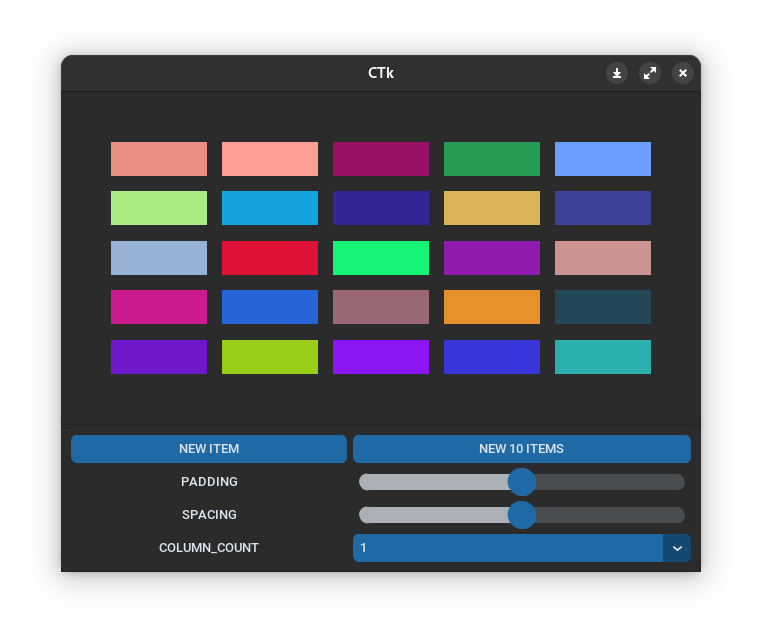
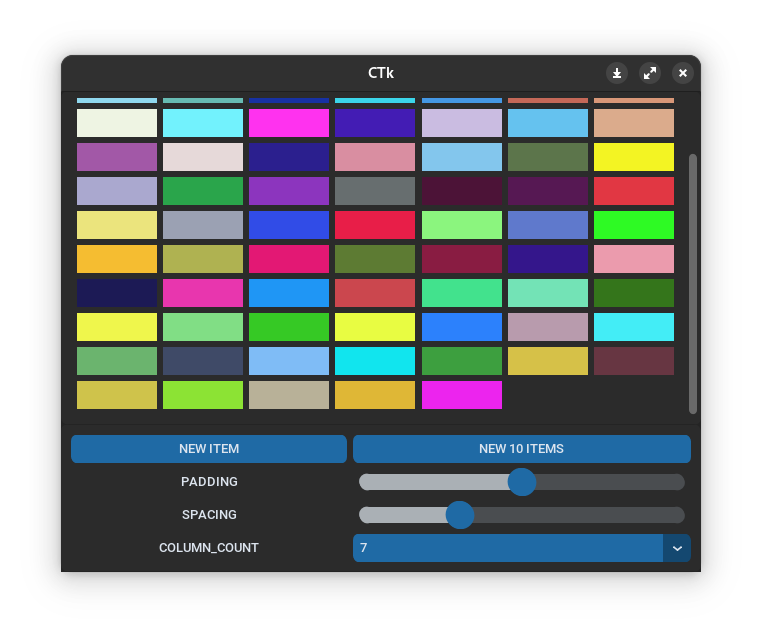
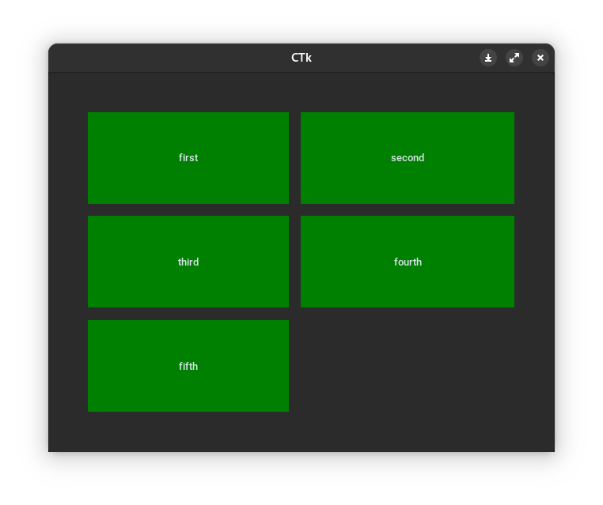

# CTkGridLayout
**Simple grid view module for [customtkinter](https://github.com/TomSchimansky/CustomTkinter) library**

| BASE                                        | SCROLLABLE                                  |
|---------------------------------------------|---------------------------------------------|
|  |  |
| `examples/grid_view.py`                     | `examples/scrollable_grid_view.py`          |


  
## How to install
```commandline
pip install https://github.com/nkeff/CTkGridLayout/releases/download/v.0.1.0/ctkgridlayout-0.1.0-py3-none-any.whl
```
or 

1) copy `ctk_grid_layout.py` file in your project
2) You must have [customtkinter](https://github.com/TomSchimansky/CustomTkinter) library installed

## Usage
```python
import customtkinter

from ctkgridlayout import CTkGridLayout

if __name__ == "__main__":
    root = customtkinter.CTk()
    root.geometry("640x480")
    root.grid_columnconfigure(0, weight=1)
    root.grid_rowconfigure(0, weight=1)

    GRID_VIEW = CTkGridLayout(master=root, column_count=2, spacing=15, padding=50)
    GRID_VIEW.add_items([
        customtkinter.CTkLabel(GRID_VIEW, text='first', fg_color='green'),
        customtkinter.CTkLabel(GRID_VIEW, text='second', fg_color='green'),
        customtkinter.CTkLabel(GRID_VIEW, text='third', fg_color='green'),
        customtkinter.CTkLabel(GRID_VIEW, text='fourth', fg_color='green'),
        customtkinter.CTkLabel(GRID_VIEW, text='fifth', fg_color='green'),
    ])
    GRID_VIEW.grid(row=0, column=0, sticky="nsew")
    root.mainloop()
```



## Methods
- **.add_item(item: customtkinter.CTkBaseClass)**: add new item in grid frame
- **.add_items(items: list[customtkinter.CTkBaseClass])**: add list of items, update function call once
- **.update_layout(column_count: int = None, spacing: int = None, padding: int = None)**: update layout (change column count view, paddings and spacing between items

## Property
- **.items**: items list in grid frame
- **.items_count**: count of items in grid frame
